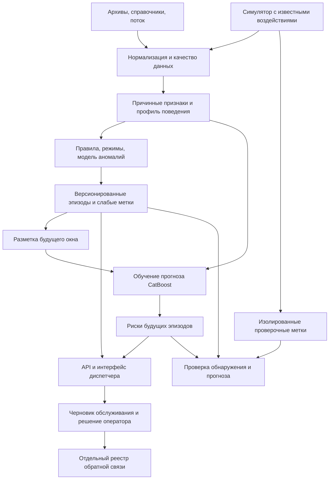

# Полный план решения: анализ поведения, прогноз и сервис диспетчера

Редакция: 20 сентября 2026 года. По указанию пользователя план определяется содержанием и зависимостями, без календарного дедлайна. Охват — все пригодные группы из 19 типов каналов. Команда: один участник сейчас, два впоследствии. Независимой разметки физических отказов и предметного эксперта для её создания нет.

Это план реализации и проверки, а не описание уже работающего продукта. Существующий код `stage1/` — основа для аудита и развития; его наличие не означает, что этап принят.

## 1. Постановка и результат

Разработать веб-сервис, который принимает журналы и поток событий, обнаруживает устойчивые отклонения поведения каналов, прогнозирует начало новых выбранных эпизодов и помогает диспетчеру назначать проверку или превентивное обслуживание.

Основное направление задания — отказ датчика. На предоставленных данных проверяемая операционная цель формулируется точнее: **прогноз нового зарегистрированного устойчивого аномального эпизода заданного типа, используемого как основание для проверки датчика**. Технический характер такого эпизода — отдельная гипотеза. Подтверждённая физическая поломка не заявляется без независимого исхода проверки.

Все пригодные группы проходят анализ. Возможность качественно прогнозировать каждую группу устанавливается отдельно; наличие детектора не гарантирует предсказуемость. Для команд и ручных сигналов необычная активность сохраняется как контекст, а не переименовывается в поломку. Пожар, проникновение и износ конструкций не становятся дополнительными обязательными направлениями этого проекта.

Продукт содержит:

1. Воспроизводимую подготовку данных, каталог типов и реестр качества.
2. Детекторы, журнал аномальных эпизодов и объяснения.
3. ML-прогноз начала выбранных эпизодов с исходным горизонтом 24 часа, статусом применимости и версией модели.
4. Дашборд, карту/схему объектов, карточку канала и журнал прогнозов.
5. Автоматическое создание черновиков превентивного обслуживания по настраиваемым правилам; решение и результат проверки сохраняются отдельно.
6. REST API, воспроизведение исторического потока, роли, журнал действий, пакет запуска и методику оценки.

Источники: [архитектура из чата](https://chatgpt.com/share/6aae3a0e-4630-83ed-8b3d-b5b5e262175e), [исходное описание](task.md), [разбор QA](qa-decisions.md), [ревью первого плана](plan-review.md), [подробности первого этапа](stage1-plan.md). В репозитории есть краткое описание задачи, но полный официальный документ со всеми нумерованными требованиями не подтверждён; его сверка входит в первую контрольную точку. Внешние ответы не заменяют явные решения пользователя.

## 2. Архитектура и роль методов из чата

Методы выполняют разные задачи:

| Компонент | Назначение | Проверка полезности |
|---|---|---|
| Устойчивые статистики и правила | Объяснимое базовое обнаружение отклонений | Поведение на контролях, покрытие и нагрузка предупреждений |
| Кластеризация режимов | Группы похожего поведения, расстояния, переходы режимов | Стабильность режимов и добавочная польза на отложенных данных |
| IsolationForest | Дополнительная оценка необычности многомерного окна | Сравнение с правилами и вклад в обнаружение/прогноз |
| Изменение режима | Подтверждение устойчивого сдвига, если обычных признаков мало | Дополнительные находки без чрезмерных повторов |
| Контекст объекта | Совместность событий, отличие локального отклонения | Только при достоверной привязке и сопоставимости |
| Слабая разметка | Прозрачное объединение свидетельств и воздержание от вывода | Версии правил, конфликты, чувствительность к порогам |
| CatBoost | Прогноз будущего начала эпизода из прошлого | Временная проверка и сравнение с прогнозными правилами |

Кластеризация и IsolationForest входят в программу сравнительных экспериментов. Их совместное применение не является самоцелью: в окончательной сборке остаются компоненты с показанной пользой. Номер кластера не назначает класс отказа. Детекторы на общих признаках не считаются независимыми голосами. Нормированный anomaly score не называется вероятностью поломки.

## 3. Инвентаризация и группировка

Использовать семь предметных групп из первого этапа: измерения среды; пожарные извещатели; охранные/контактные каналы; затопление; состояние оборудования; питание/аппаратура; управление/ручные сигналы. Все 19 типов включаются в реестр. Группировка описывает назначение; способ обработки задаётся отдельно.

Для каждого типа и при необходимости отдельного канала заполнить:

- числовые показания, дискретные состояния и смешанный формат;
- единицы, диапазоны и возможные технические коды с источником трактовки;
- режим регистрации: периодический, по изменениям либо неизвестный;
- связь с объектом и ограничения исторической привязки;
- доступность собственной динамики, длительностей, молчания, сравнения соседей и прогнозной метки;
- допустимые типы целевых эпизодов; роль: датчик, состояние агрегата, команда или контекст;
- фактическое число каналов и интервалов, пригодных для каждой операции.

Числовая собственная динамика может быть доступна без единиц; физические пороги и сравнение разных каналов при этом недоступны. Неизвестная периодичность не запрещает анализ наблюдаемых переходов, но запрещает считать молчание доказанным отказом. Не применять один глобальный флаг пригодности ко всем операциям.

Получить обновлённый справочник с `ид_объект`, проверить внешний ключ, покрытие и отсутствие размножения записей. До получения — отдельная группа «объект не установлен». Не угадывать объект по тегу и не размещать непривязанные реальные каналы на выдуманных объектах. Геометрия для демонстрации может быть синтетической; происхождение геометрии и происхождение привязки каналов — разные признаки.

## 4. Данные, хранение и воспроизводимость

### 4.1. Загрузка

1. Реестр файлов: имя, хеш, размер, схема, диапазон дат, версия справочника, результат проверки.
2. Поэтапное чтение архивов с ограничением памяти; первичная инвентаризация всех доступных лет. Архив 2021 сейчас отсутствует, старые отчёты о нём не заменяют файл.
3. Нормализация даты, времени, тревоги, числового/текстового значения без потери исходной строки и её происхождения.
4. Отдельный карантин для неверных дат, ID, нечисловых маркеров и конфликтов. Дедупликация по содержимому и происхождению, а не по одному `ид_события`.
5. Несколько разных значений в одну секунду сохранять как неупорядоченную группу; признаки, которым нужен неизвестный порядок, не вычислять. Порядок строк файла не объявлять физическим временем.
6. Подготовленные события записывать в Parquet с разбиением по календарному периоду и корзинам каналов; сортировать внешними проходами. Не собирать весь журнал в один список в памяти.
7. Для пересчёта хранить манифест, версии преобразований и контрольные итоги: прочитано, принято, повторено, конфликтно, исключено.

Исходные архивы неизменяемы. Пример журнала анализируется отдельно, не добавляется к архивам без проверки пересечений. Новая версия справочника не изменяет задним числом старые результаты без явного пересчёта.

### 4.2. Два слоя хранения

- Parquet/локальное файловое хранилище: полная история, подготовленные признаки, снимки выборок, сценарии и модели.
- PostgreSQL: справочники приложения, статусы загрузок, свежие агрегаты, эпизоды, прогнозы, заявки, пользователи и аудит. Веб-запрос не сканирует архивы.

Для потоковой обработки использовать те же функции признаков и правил, что в историческом расчёте, с состоянием на канал и ограниченными окнами. Результаты офлайн-расчёта и последовательного воспроизведения на одинаковом префиксе должны совпадать.

### 4.3. Время

Сохранять время события и время поступления отдельно. Для старых архивов фактическая задержка поступления неизвестна: исторический replay использует явно обозначенное предположение. Исходное время журнала хранить без придуманной зоны; для приложения вводится документированная конфигурация зоны, рабочее допущение — Europe/Moscow до подтверждения. Преобразование в API/БД не должно молча сдвигать часы.

Поздние события проходят ограниченный пересчёт затронутого окна. Прогнозы, уже показанные диспетчеру, не переписываются: сохраняется новая ревизия с причиной. Повторная доставка события не создаёт вторую заявку.

## 5. Контракты и семантика результатов

Существующие `NormalizedEvent` и `Episode` в `stage1/contracts.py` сначала сопоставить с этой схемой. Изменения делать через версию и миграцию, сохраняя воспроизводимость предыдущих запусков.

| Сущность | Обязательные поля/смысл |
|---|---|
| Событие | channel_id, event_time, received_time при наличии, raw_value, numeric_value/state, alarm, тип, источник, версия справочника, флаги качества |
| Пригодность операции | канал, момент/интервал, операция, available/insufficient/unsupported/conflict, причины, доступная история |
| Эпизод | ID, канал/связанные каналы, anomaly_kind, start_at, confirmed_at, end_at или open, evidence, ruleset_version, происхождение |
| Интерпретация | anomaly_decision отдельно от observation_status; cause_hypothesis с unknown; основания включения в конкретную прогнозную цель |
| Прогноз | канал, as_of, target_kind, horizon, raw_score, calibrated_probability только при обоснованной калибровке, status, причины, версии модели/признаков/разметчика |
| Черновик обслуживания | связь с прогнозом/эпизодом, объект если известен, рекомендуемая проверка, приоритет, срок как правило сервиса, статус, автор изменений |
| Обратная связь | решение, комментарий, время, оператор, способ проверки, observed/simulated, ссылка на исходную карточку |

Различать четыре состояния интерфейса: **прогноз будущего**, **обнаруженный эпизод**, **нет превышения рабочего порога**, **оценка недоступна**. `null` не превращается в нулевой риск. Неизвестная физическая причина не удаляет достоверно обнаруженное необычное поведение.

Все сущности содержат `run_id` и версии. Для синтетики происхождение наблюдения, воздействия и решения оператора хранится раздельно. Поля сценария, будущего исхода, source-файла с закодированным классом и произвольные ID, раскрывающие метку, исключаются из ML-признаков явным списком разрешённых полей.

## 6. Первый этап: детекторы и слабая разметка

### 6.1. Профили и признаки

Собственный профиль строится из доступного прошлого: устойчивый уровень/разброс, частота событий, структура переходов, типичные состояния. Сезонность и час/день учитываются там, где наблюдаемость позволяет отделить их от артефактов записи. Самый частый режим не объявляется физически нормальным.

Окна 1/6/24 часа и 7 дней — исходные кандидаты, не обязательные для разреженных рядов. Вместе с каждой статистикой хранить число точек, возраст наблюдений, покрытие и флаг вычислимости. Для нерегулярной записи не трактовать среднее по событиям как среднее по времени. Временные наклоны рассчитывать по реальным интервалам.

MAD=0, неизвестное разрешение прибора, новый канал и смена режима имеют отдельную обработку. Не вводить универсальную абсолютную поправку вроде 0,5 для температуры и всех газов. Масштаб определяется из предшествующей вариативности/разрешения при наличии сведений; иначе соответствующая оценка не вычисляется.

Текстовые состояния числового канала не теряются. У смешанного канала параллельно считаются доступные числовые и дискретные признаки; выбор одного «основного» режима не отключает остальные.

### 6.2. Эксперименты

Последовательно сравнить: только правила; правила плюс IsolationForest; правила плюс признаки кластеров; сочетание полезных компонентов; при необходимости отдельное обнаружение смены режима. Использовать одни и те же периоды и бюджеты уведомлений.

Модели режимов обучать внутри совместимых семейств. Минимальная исходная реализация кластеризации — MiniBatchKMeans с подбором числа режимов на разработке; сложные альтернативы оправдывать измеримым улучшением. Ни газовая группа с большим числом строк, ни отдельный часто пишущий канал не должны определять всю норму: применять стратификацию и ограничение вкладов по каналам/периодам, сохранять веса выборки.

Контекст объекта добавлять отдельным блоком со своим статусом доступности. Совместность сигналов не доказывает причину, а несогласие двух датчиков не отменяет исходную тревогу.

### 6.3. Объединение в эпизоды

Задать по виду аномалии: условие начала, устойчивость, подтверждение, восстановление, объединение близких фрагментов и паузу уведомлений. Для состояния важны и число наблюдений, и время, когда режим регистрации позволяет его учитывать.

Сохранять всю последовательность эпизодов канала, не только последний результат. Отдельно хранить журнал уведомлений: подавление повторов не удаляет эпизоды и не меняет метку. Общие события связать родительским эпизодом с сохранением исходных каналов; оценку по каналам и по группам событий показывать раздельно.

Положительная слабая метка означает соответствие определению целевого аномального эпизода. Узкая гипотеза технического сбоя требует отдельных оснований. Технический код, флаг тревоги, редкий кластер или высокий anomaly score по отдельности не являются доказанной поломкой.

**Приёмка первого этапа:** реестр всех типов и пригодных операций; полный каталог по заявленному периоду; причинный replay; версии; контроли и синтетические проверки по всем применимым группам; измеренное покрытие; объяснимость и реальные примеры. Нет требования получить физический диагноз по каждому каналу.

## 7. Симуляции и независимая проверка

Два набора нужны для разных вопросов:

- Детектор: устойчивый сдвиг, шум, дрейф, переключения, зависание только при известной регистрации, технические сообщения, общие сбои. Контроли: стабильность, обычный цикл, единичная тревога, сезонное изменение, общая среда, пропуск выгрузки.
- Прогноз: постепенные предвестники с отдельно заданным началом деградации и целевого эпизода; внезапные изменения без предвестника как проверка пределов предсказуемости. Успешное обнаружение внезапного скачка после начала не засчитывается как прогноз.

Для сценария фиксировать смысл, применимые типы, единицы/нормализацию, форму, длительность, амплитуду, механизм регистрации, эталонные времена и ожидаемые ограничения. Параметры не определять как «порог детектора плюс один». Сохранять фоновый исходный отрезок; гарантированно чистая синтетическая основа и реальный фон с неизвестными нарушениями оцениваются раздельно.

Разделить настройку и проверку до генерации: непересекающиеся исходные отрезки/эпизоды, отложенные параметры, по возможности отложенные формы воздействия и каналы. Вариации одного фрагмента не распределять по train/test. Новое зерно при той же формуле — лишь повторяемость, не доказательство независимости.

Скрытые эталонные метки доступны только модулю оценки. Не кодировать класс в используемом признаке channel_id, timestamp-шаблоне, именах файлов, плотности записей, если это не часть проверяемого механизма. При моделировании журнала изменений генерировать сам процесс регистрации, а не только плотный ряд физических значений.

## 8. Прогнозная метка и временное разделение

### 8.1. Цель

Для заданного вида эпизода k и горизонта H=24 часа:

- `y=1`: новое начало целевого эпизода лежит в `(t, t+H]`, сам эпизод подтверждён по замороженным правилам, а на t он ещё не начался.
- `y=0`: будущее окно достаточно наблюдаемо по правилам задачи и в нём нет нового целевого начала.
- `y=unknown`: недостаточная история/наблюдаемость, конфликт, незавершённое будущее окно, неопределённая граница эпизода либо эпизод уже продолжается.

Это метка зарегистрированного псевдоэпизода, не отсутствия/наличия физической поломки. Положительные и отрицательные примеры для основного сравнения используют одинаковую политику доступности будущего; долю исключённого показывать по классам и типам. Отдельный анализ частично наблюдаемых положительных событий допустим только как дополнительная оценка.

`start_at` — начало выбранного целевого состояния; `confirmed_at` — момент доступности подтверждения. Предупреждение засчитывается до `start_at`, а не до `confirmed_at`. Для прогнозов деградации до критического состояния два определения фиксируются отдельно; границы нельзя менять после просмотра результата.

### 8.2. Протокол v2 для прогноза

Существующий `stage1/config/evaluation_protocol.json` — протокол v1 детектора. Сохранить его для воспроизведения; прогнозный эксперимент получает новый протокол и отдельные результаты. Предлагаемое исходное разбиение:

| Период | Роль |
|---|---|
| Январь–сентябрь 2024 | Разработка/обучение разметчика, профилей и моделей режимов |
| Октябрь–декабрь 2024 | Проверка и настройка разметчика, фиксация его версии |
| Январь–июнь 2025 | Формирование слабых меток и обучение прогнозиста замороженным разметчиком |
| Июль–декабрь 2025 | Выбор параметров прогнозиста, порога предупреждения и политики повторов |
| Январь–июнь 2026 | Замороженная ретроспективная проверка обоих компонентов |

Это стартовый дизайн, который надо проверить на объёме данных до финальной настройки. При недостатке событий расширять обучение более ранними пригодными периодами или использовать последовательные временные блоки, сохраняя запрет обучения на будущем. 2021 — отдельный режим миграции. Периоды 2025–2026 уже изучались ранее, поэтому название «полностью нетронутый тест» недопустимо.

Ни профили, ни кластеры, ни imputer/scaler не обучаются на последующей валидации/тесте. Для новых каналов профиль может строиться из их доступного прошлого по заранее фиксированной процедуре с явным прогревом; это отдельно от глобального обучения. Одинаковый алгоритм прогрева применяется в тесте и сервисе. Без будущей очистки «нормальных» фрагментов.

Для каждого split удалить примеры, у которых окно метки или подтверждение пересекает следующую часть. Для переходов граница исключения зависит от H и максимальной задержки подтверждения. Эпизод, начавшийся до split, не становится новым в следующем. Исторический контекст признаков до границы допустим, обучать преобразования на будущих строках — нет.

Часовая сетка прогнозов — стартовая настройка. Она едина в обучении, replay и оценке. Перекрывающиеся окна одного эпизода не считать независимыми; ограничивать их вклад при обучении. ID канала/объекта по умолчанию не использовать как средство запоминания; сравнить отдельно, если есть обоснование. При достаточных данных добавить проверку на новых каналах/объектах.

## 9. Обучение и выбор прогнозной модели

1. Построить прогнозные baseline: частота эпизодов по типу, повторяемость после прошлого эпизода, простые причинные тенденции. Они используют те же доступные признаки и горизонт.
2. Обучить CatBoost на прошлых статистиках, состояниях, режимах и доступном контексте. Схема признаков фиксируется; признаки будущих эпизодов и подтверждений запрещены.
3. Начать с моделей по способу обработки/совместимому семейству, затем проверить объединённую модель с типом и отдельные модели там, где данных достаточно. Решение выбирается по метрикам по типам, а не по числу моделей.
4. При дисбалансе сравнить веса классов и контролируемую выборку отрицательных на обучении. Валидация/тест сохраняют естественное соотношение внутри заявленной наблюдаемой популяции. Не балансировать тест для красивого Precision.
5. Выбрать порог на валидации по кривой «обнаружение — число уведомлений»; исходные ориентиры Precision>0,7 и Recall>0,5 учитывать как цели QA, не обещание. Не снижать критерий после просмотра финального результата без новой версии эксперимента.
6. Проверить калибровку на отдельной разрешённой части валидации при достаточном объёме. Оценка вероятности относится только к определённому псевдоэпизоду и наблюдаемой популяции. При недостатке данных показывать индекс/уровень риска без процента физической поломки.
7. Проверить вклад кластера, IsolationForest, контекста и истории неисправностей через отключение блоков. Объяснение модели показывает факторы оценки, не причинный диагноз.
8. Зафиксировать модель, preprocessing, разметчик, признаки, пороги, временной протокол и отчёт единым набором артефактов. Не переобучать автоматически по имитированным решениям оператора.

Если нет достаточных реальных слабых меток, допускается отдельная модель на синтетических сценариях с явным статусом «проверено на симуляциях». Её качество не переносится на реальные каналы. Если ML проигрывает простому прогнозному правилу, это отражается в отчёте; правило может обслуживать демонстрацию с явным указанием метода, а ML остаётся исследовательским. Это не считается доказанным успехом ML-прогноза соответствующей группы.

## 10. Оценка и условия допуска

| Уровень | Основные показатели | Что они доказывают |
|---|---|---|
| Детектор на известных воздействиях | Precision/Recall эпизодов, задержка, повторы, контрольные ошибки | Обнаружение заданных сценариев |
| Прогноз псевдоэпизодов | Precision/Recall предупреждений/эпизодов, PR-AUC по временным точкам, упреждение | Предсказуемость замороженного определения аномалии |
| Прогноз синтетического исхода | Те же показатели по механизму и длительности предвестника | Работу на указанном генераторе |
| Реальная история без истины | Покрытие, частота кандидатов, устойчивость, объяснения, примеры | Воспроизводимость и правдоподобие метода, не физическую точность |
| Сервис | Время расчёта, задержка потока, память, повторяемость, ошибки API | Возможность эксплуатации демонстрационного процесса |

Для прогноза предупреждение сопоставляется с одним будущим эпизодом того же канала и вида в пределах H, строго до начала. Один эпизод засчитывается один раз. Правило разрешения неоднозначных совпадений фиксируется до оценки; повторные уведомления отражаются отдельной нагрузкой и штрафом согласно протоколу. Для детектора используется отдельное окно совпадения после начала, поэтому его Precision/Recall нельзя называть метриками прогноза.

Всегда показывать: число каналов, длительность наблюдений, независимые эпизоды, знаменатели метрик, долю unknown, исключённые типы/интервалы, микро- и показатели по группам. При нулевом знаменателе — «не определено». Не удалять ошибки из оценки потому, что модель воздержалась: для событий внутри заранее определённой пригодной области отсутствие предупреждения — пропуск; за её пределами отдельно считать необслуженные события и покрытие.

Неопределённость метрик оценивать повторной выборкой по каналам/эпизодам или объектам при связи, а не по коррелированным часовым строкам. Сравнения проводить при одинаковом бюджете предупреждений. Рабочую точку выбирать до финального теста. Исторические метрики старой дымовой модели не переносятся на новую цель.

**Допуск по семейству:** есть оба класса в обучении и проверке; определённая наблюдаемая популяция; достаточный для осмысленной оценки объём с опубликованными интервалами неопределённости; причинность и воспроизводимость; сравнение с baseline; понятные ограничения. Универсальное число вроде «30 эпизодов достаточно для всех» не вводится. При недостатке данных статус `insufficient_evidence`, а не успешная приёмка.

## 11. Сервисная архитектура

Предложение для репозитория на Python: **модульное Django-приложение**, PostgreSQL, отдельный процесс обработки/ML, шаблоны интерфейса с JavaScript-компонентами графиков и карты. Это инженерный выбор для единого домена пользователей, данных и действий; наличие Django у заказчика не требует совместимости с его внутренним кодом.

Использовать Python-серию проекта после проверки совместимости всех зависимостей. Django 6.0 поддерживает Python 3.14; точные версии фиксировать после проверенного запуска окружения. Стандартные пользователи/группы Django дают основу аутентификации, но область объектов проверяется в каждом запросе отдельно. [Совместимость Django](https://docs.djangoproject.com/en/6.0/releases/6.0/), [аутентификация и права](https://docs.djangoproject.com/en/6.0/topics/auth/default/).

Компоненты:

- `stage1/`: после аудита — чистая предметная библиотека качества, признаков, аномалий и эпизодов.
- `ml/forecast/`: подготовка прогнозных выборок, обучение, оценка, сериализация и инференс новой цели; старый `ml/smoke_failure/` остаётся отдельным историческим экспериментом.
- `service/`: справочники, API, пользователи, карточки, заявки, аудит; использует библиотечные функции и версии моделей.
- `worker/`: импорт, replay и периодический расчёт; тяжёлые задания не выполняются в HTTP-запросе.
- `configs/` и `docs/`: версии протоколов, сценариев, моделей, документация и демонстрация.

Начальная очередь заданий — таблица БД с состояниями, блокировкой на получение, lease, повторными попытками и checkpoint. Перезапуск продолжает работу; истёкшая lease позволяет подобрать задание снова; сохранение результата идемпотентно. Выделенная очередь/брокер добавляется по нагрузке, не является условием корректности первого сервиса.

### Поток

Приём → проверка схемы → сохранение → очередь → обновление доступных окон → детектор → прогноз при допуске → сохранение результатов → обновление интерфейса. Исторический replay и внешнее поступление используют этот же путь. Синтетические и реальные запуски изолированы `run_id`, состоянием окон и БД-областями.

Обучение выполняется отдельно от инференса. На запрос прогноза модель не обучается заново и не перечитываются все архивы. Измерить время полного инкрементального расчёта заявленного парка: ориентир исходной задачи <5 минут; отдельно публиковать время загрузки истории, прогрева и обучения. Нагрузка, CPU/RAM и число пригодных каналов обязательны рядом с результатом измерения.

## 12. API и пользовательские сценарии

### 12.1. Минимальный контракт API

| Маршрут | Назначение |
|---|---|
| `POST /api/v1/imports` | Зарегистрировать импорт файла; вернуть ID фонового задания |
| `POST /api/v1/events:batch` | Принять пакет событий с ключом идемпотентности |
| `GET /api/v1/jobs/{id}` | Прогресс, ошибки, версии и контрольные итоги задания |
| `GET /api/v1/objects`, `/channels` | Доступные пользователю объекты/каналы, фильтры, пагинация |
| `GET /api/v1/channels/{id}/history` | Ограниченный диапазон истории и качество данных |
| `GET /api/v1/episodes`, `/forecasts` | Найденные эпизоды и прогнозы, раздельные сущности |
| `GET /api/v1/forecasts/{id}` | Горизонт, статус, объяснение и доступная история |
| `POST /api/v1/maintenance-drafts` | Создать черновик по результату, без дубликата |
| `PATCH /api/v1/maintenance-drafts/{id}` | Разрешённый переход статуса с контролем версии |
| `POST /api/v1/reviews` | Сохранить решение оператора и основание проверки |
| `GET /api/v1/health` | Готовность приложения/модели без выдачи секретов |

Зафиксировать OpenAPI: типы, временную зону, ограничения размера/диапазона, пагинацию, коды ошибок, семантику null, версионирование, ключи повторной доставки. Чужие объекты недоступны и в списках, и по прямому ID, и в экспорте. Все изменения журналируются.

### 12.2. Экран диспетчера

1. **Обзор:** актуальность данных, прогнозы будущих эпизодов, обнаруженные аномалии, недоступные оценки, группы и фильтры.
2. **Карта/схема:** объекты и агрегированный приоритет внимания; схема помечена как условная, если координаты синтетические. Непривязанные каналы доступны отдельным списком.
3. **Карточка:** динамика, текущий эпизод и будущий прогноз на разных слоях, основания, горизонт, момент расчёта, качество, версия и рекомендуемая проверка. Индекс аномалии и вероятность псевдоэпизода не смешиваются.
4. **Журнал:** история прогнозов, эпизодов, подтверждений, отмен и заявок; действие диспетчера не удаляет прогноз.
5. **Обслуживание:** черновик, назначение/рассмотрение, выполненная проверка и исход. Совместные события не создают десятки одинаковых выездов.

Агрегирование объекта — приоритет/число затронутых каналов и максимальный доступный уровень, не «вероятность аварии объекта». Не применять формулу независимых вероятностей к зависимым каналам. Показывать знаменатель покрытия и неизвестные оценки.

### 12.3. Черновики и обратная связь

Автоматическое правило создаёт черновик только для допустимого вида эпизода/прогноза при достаточной актуальности и превышении выбранного порога. Низкое качество создаёт задачу проверки данных, не диагноз отказа. Ключ `(target, kind, episode_or_alert_group)` и временная политика предотвращают дубли; повышение приоритета обновляет существующий черновик с записью действия.

Человек принимает решение: проверить, отклонить с причиной, назначить обслуживание, закрыть с результатом. «Решение оператора», «исход осмотра» и «синтетический ответ» — разные сведения; одобрение черновика не является подтверждением поломки. Внешняя система заявок представлена адаптером/эмулятором с явным статусом доставки. Реальная отправка не требуется по QA.

### 12.4. Доступ и защита

Роли по QA: техник в пределах комплекса, диспетчер района, диспетчер ОДС по всей разрешённой области, администратор. Группы областей видимости суммируются по описанным правилам. Локальная аутентификация с ролями и проверяемыми ограничениями; LDAP/AD через адаптер или демонстрационный контур, без подключения к реальной инфраструктуре.

Проверить полное ТЗ для точных требований к MFA/TLS и составу аудита; слова про эмуляцию интеграций не отменяют собственные механизмы защиты приложения. Для публичного размещения — HTTPS, секреты вне репозитория, отключённый debug, защищённые сессии, ограничения загрузок и проверка прав. Файлы импорта разбираются как данные. Внутренние адреса, команды оболочки и исполняемые файлы не принимаются из пользовательского импорта.

## 13. Проверки реализации

Обязательные проверки связаны с реальными рисками:

- Изменение любых событий после t не меняет результат на t; обученные преобразования не используют последующий split.
- Метки на границе H, подтверждения, открытого эпизода, паузы и конца файла корректны; наблюдаемость канала не подменяется датой последней записи всего архива.
- Повторы и конфликтующие секунды не меняют результат случайным порядком; импорт после перезапуска идемпотентен.
- Смешанный канал сохраняет числа и состояния; MAD=0, неизвестные единицы и редкие каналы имеют проверенный исход.
- Признаки, применимость и результаты исторического и потокового прохода совпадают на одних префиксах.
- Простой прогноз, CatBoost и детектор оцениваются раздельно и на одинаковых допусках; проверочные метки симулятора не попадают в признаки.
- Повторные прогнозы не размножают заявки; одновременное изменение карточки не теряет решение пользователя.
- Пользователь не видит чужой объект через прямой запрос, фильтр, историю, экспорт или связанные заявки.
- Восстановление после падения worker не оставляет бесконечно running-задания; сбой загрузки новой модели сохраняет предыдущую работоспособную версию.
- Пакет запускается в чистом окружении, миграции и демонстрационные данные воспроизводимы; исходные большие архивы не обязательны для знакомства с демо.

Тестовые сценарии составлять до реализации соответствующего поведения. Существующие тесты `stage1/` проверить и подключить к общей CI; наличие файлов тестов не означает, что текущая CI их запускает. Замеры памяти/скорости провести на реальном объёме с указанными параметрами.

## 14. Этапы и условия перехода

| Этап | Работа | Артефакт | Условие перехода |
|---|---|---|---|
| A. Постановка и аудит основы | Сверка ТЗ/QA, существующего `stage1/`, типов, источников и контрактов | Матрица требований и пригодности, список доработок | Различены аномалия, причина, цель прогноза; каждый тип учтён |
| B. Данные и признаки | Импорт, качество, сортировка, профили, единые окна | Версионированная выборка и отчёт покрытия | Воспроизводимый ограниченный по памяти проход всех типов |
| C. Детектор | Правила, эксперименты IF/режимов, слабые метки и эпизоды | Каталог эпизодов и отчёт детектора | Причинность, контроли, объяснения; применимость по группам |
| D. Прогноз | Протокол v2, метки, baseline, CatBoost, пороги и калибровка | Модель и отчёт по семействам | Проверка будущих начал, сравнение, ограничения; отсутствие утечки |
| E. Сервис | API, БД, worker, интерфейс, роли, карта, заявки | Сквозной работающий сценарий | Интеграционные проверки, защита доступа, сохранение решений |
| F. Проверка продукта | Replay, нагрузка, восстановление, демонстрация | Отчёт сценариев и характеристик | Успешный повторный запуск и честные состояния недоступности |
| G. Сдача | Пакет, инструкция, методика, ограничения и видео | Комплект по требованиям конкурса | Проверенный запуск из поставляемого комплекта |

E начинается после фиксации контрактов в A и развивается параллельно B–D на явно демонстрационных результатах. Подключение реальных моделей происходит после их допуска. C завершается отдельно от D; переход не требует доказанной физической диагностики, но требует пригодной и достаточно разнообразной разметки выбранной задачи. Полный период означает заявленный период эксперимента, а не автоматически все годы с 2019.

Для двух участников: первый отвечает за данные, методы и артефакты моделей; второй — за сервис, интерфейс, упаковку и воспроизводимый запуск оценки по замороженному протоколу. Проверку методики, схем и результатов проводят совместно. При одном участнике работы идут по зависимостям, начиная с минимального сквозного сценария; готовая оболочка не выдаётся за готовую модель.

## 15. Сдаваемые результаты и условия завершения проекта

- Пакет приложения, конфигурации окружения, миграции, инструкции установки, запуска, восстановления и повторного обучения.
- Модели с привязанными версиями признаков/разметчика, перечнем поддержанных групп, результатами сравнения и статусами ограничений.
- Отчёт данных: источники, покрытие, качество, исключения, режимы регистрации, неизвестные сведения.
- Методика: определения эпизодов/меток, временные границы, выбор порогов, синтетические сценарии, разделение обнаружения и прогноза.
- Отчёт качества: по типам/семействам, знаменатели, неопределённость, нагрузка, задержка/упреждение, baseline и ограничения переносимости.
- REST API с документацией, демонстрационный набор и replay; сквозные сценарии локальной аномалии, общего события, неизвестных данных и черновика обслуживания.
- Матрица «требование → реализация → проверка → ограничение/обоснованное отклонение». Полное официальное ТЗ должно быть сверено перед финальной приёмкой; краткого `task.md` для заявления о полном соответствии недостаточно.
- Видео/демо как дополнительный способ показать продукт, не замена запускаемого пакета.

Проект не считается завершённым лишь потому, что есть графики и классификатор. Нужны действующий сквозной сценарий, воспроизводимая оценка, рабочие обязательные функции и честные границы применимости. Если прогноз определённой пригодной группы не подтверждён, это отдельный незакрытый результат, а не скрытый нулевой риск.

## 16. Открытые зависимости и технические источники

Для полноценного контекста объектов нужен обновлённый справочник. Для строгих физических трактовок — сведения о регистрации, единицах и технических кодах. Без них доступные статистические операции продолжаются; зависимые выводы явно отключены. Полное официальное ТЗ требуется для окончательной матрицы приёмки. Эти зависимости не мешают реализации известных частей.

Проверенные технические основания: [scikit-learn: предотвращение утечки](https://scikit-learn.org/stable/common_pitfalls.html), [калибровка вероятностей](https://scikit-learn.org/stable/modules/calibration.html), [CatBoost: выход predict_proba](https://catboost.ai/docs/en/concepts/python-reference_catboostclassifier_predict_proba). Сам факт наличия probability API не подтверждает калибровку или физический смысл целевой переменной.
